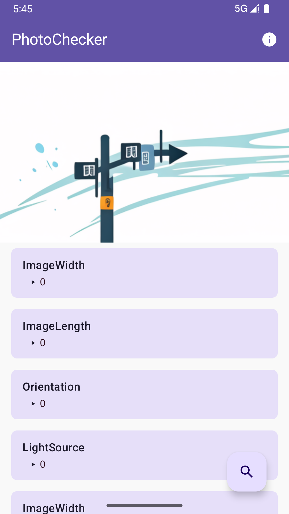
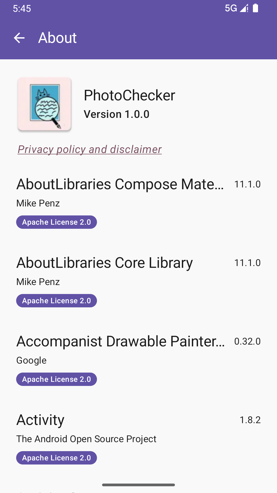

# PhotoChecker Monorepo

A cross-platform EXIF viewer application supporting Android, HarmonyOS, Web, and Desktop (Tauri) platforms.


Your handy tool to view EXIF information of your photos! With this lightweight and simple app, you can effortlessly select any photo from your device and delve into its EXIF data. Gain insights into camera settings, date and time of capture, location, and much more. Whether you're a photography enthusiast or just curious about the technical details behind your images, PhotoChecker has got you covered.

## Screenshots

|  |  |  |
| :-------------------------------: | :-------------------------------: | :-------------------------------: |

## 🚀 Quick Start

### Prerequisites

- Node.js >= 18.0.0
- pnpm >= 8.0.0

### Installation

```bash
# Install dependencies
pnpm install

# Install and setup git hooks
pnpm prepare
```

### Development

```bash
# Start Tauri development server
pnpm tauri:dev

# Build all projects
pnpm build

# Run all tests
pnpm test

# Lint all projects
pnpm lint

# Format all projects
pnpm format
```

## 📁 Project Structure

```
PhotoChecker/
├── packages/           # Shared packages (future)
├── apps/               # Applications (future)
├── tauri/             # Tauri desktop application
├── android/           # Android native application
├── harmony/           # HarmonyOS application
├── web/               # Web application
├── package.json       # Root workspace configuration
├── pnpm-workspace.yaml # pnpm workspace configuration
└── .gitignore         # Git ignore rules
```

## 🛠 Available Scripts

### Root Workspace Scripts

- `pnpm build` - Build all projects
- `pnpm dev` - Start development servers for all projects
- `pnpm test` - Run all tests
- `pnpm lint` - Lint all projects
- `pnpm lint:fix` - Fix linting issues
- `pnpm format` - Format all projects
- `pnpm format:check` - Check formatting
- `pnpm typecheck` - Type check all projects
- `pnpm clean` - Clean all node_modules and build outputs

### Platform-specific Scripts

- `pnpm tauri:dev` - Start Tauri development server
- `pnpm tauri:build` - Build Tauri application
- `pnpm android:build` - Build Android application
- `pnpm harmony:build` - Build HarmonyOS application
- `pnpm web:build` - Build and serve web application

## 🎯 Platforms

### Desktop (Tauri)

- **Location**: `./tauri/`
- **Tech Stack**: React, TypeScript, Vite, Tauri 2
- **Commands**: `pnpm tauri:dev`, `pnpm tauri:build`

### Android

- **Location**: `./android/`
- **Tech Stack**: Kotlin, Jetpack Compose
- **Commands**: `pnpm android:build`

### HarmonyOS

- **Location**: `./harmony/`
- **Tech Stack**: ArkTS
- **Commands**: `pnpm harmony:build`

### Web

- **Location**: `./web/`
- **Tech Stack**: Static files with Docker
- **Commands**: `pnpm web:build`

## 🔧 Development Workflow

1. **Make changes** to any platform-specific project
2. **Test locally** using the development server for that platform
3. **Run linting** with `pnpm lint`
4. **Format code** with `pnpm format`
5. **Commit changes** using the conventional commit format
6. **Test across platforms** to ensure consistency

## 📝 Git Workflow

This monorepo uses conventional commits and automated tools for quality control:

### Commit Guidelines

- **Use conventional commit format**: `type(scope): description`
- **Interactive commits**: Use `pnpm commit` for guided commit creation
- **Commit validation**: Commits are automatically validated with commitlint

### Available Commit Types

- `feat`: 新功能 (New features)
- `fix`: 修复 bug (Bug fixes)
- `docs`: 文档更新 (Documentation updates)
- `style`: 代码格式调整 (Code formatting changes)
- `refactor`: 重构 (Code refactoring)
- `test`: 增加测试 (Adding tests)
- `build`: 构建相关变动 (Build related changes)
- `ci`: CI/CD 配置变动 (CI/CD configuration changes)
- `chore`: 其他修改 (Other changes)
- `revert`: 回滚 (Reverting changes)

### Git Hooks

- **pre-commit**: Runs lint-staged to format and lint staged files
- **commit-msg**: Validates commit messages with commitlint

### Release Management

- `pnpm release`: Creates a new release with changelog
- `pnpm release:patch`: Bump patch version
- `pnpm release:minor`: Bump minor version
- `pnpm release:major`: Bump major version

## 📦 Package Management

This monorepo uses **pnpm workspaces** for dependency management:

- **Single lockfile**: `pnpm-lock.yaml` at root
- **Hoisting**: Dependencies are shared between packages
- **Efficient**: Faster installs and less disk space

## 🤝 Contributing

1. Fork the repository
2. Create a feature branch
3. Make your changes
4. Follow the commit message format
5. Submit a pull request

## 📄 License

This project is licensed under the MIT License - see the [LICENSE](LICENSE) file for details.
