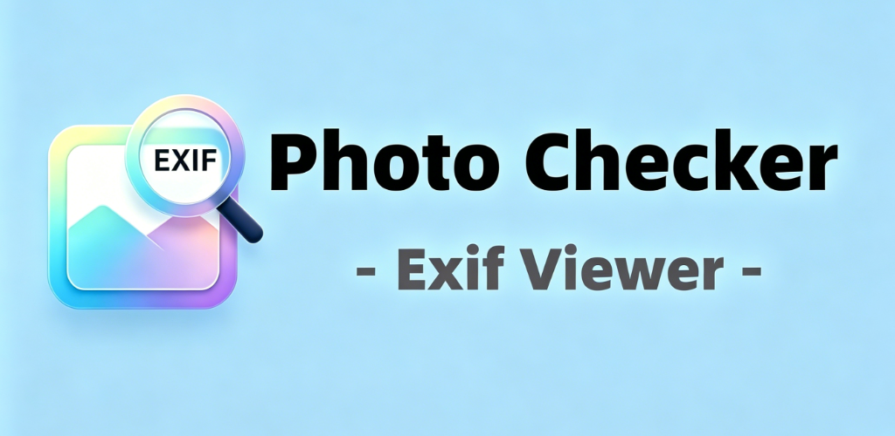

# PhotoChecker Monorepo

A cross-platform EXIF viewer application supporting Android, HarmonyOS, Web, and Desktop (Tauri) platforms.



View the EXIF metadata hidden inside your photos — and strip the parts that put your privacy at risk.

Every photo you take carries hidden data: the camera and lens used, exposure settings, the exact date and time, and often a precise GPS location pinpointing where it was taken. PhotoChecker reveals all of it, and lets you remove it before you share.

🔍 **Read every detail**
Inspect the full EXIF metadata of any JPEG, PNG, or WebP image — camera make and model, lens, aperture, shutter speed, ISO, focal length, capture timestamp, software, and more.

⚠️ **Privacy risk at a glance**
Each photo is color-coded by privacy risk. A single glance tells you whether it contains high-risk GPS data, identifying device info, or is safe to share.

🗺️ **Locations, visualized**
If a photo has GPS coordinates, tap to open it in your map app and see exactly where it was captured.

🔎 **Spot tampering**
Consistency warnings flag suspicious signs — a capture time that disagrees with the file, mismatched dimensions, or an embedded thumbnail that may reveal the pre-edit original.

🧹 **Clean before you share**
Remove exactly what you want:
• Location data (GPS)
• Personal and device identifiers
• All metadata for a truly clean file
Then share the cleaned image to any app, or save it to your gallery.

**Private by design**
• 100% on-device — your photos never leave your phone
• No ads, no accounts, no network access
• Large-screen and foldable friendly
• Light and dark themes

Lightweight and built for one job: showing you what your photos know about you, and helping you take control.


## 🚀 Quick Start

### Prerequisites

- Node.js >= 18.0.0
- pnpm >= 8.0.0

### Installation

```bash
# Install dependencies
pnpm install

# Install and setup git hooks
pnpm prepare
```

### Development

```bash
# Start Tauri development server
pnpm tauri:dev

# Build all projects
pnpm build

# Run all tests
pnpm test

# Lint all projects
pnpm lint

# Format all projects
pnpm format
```

## 📁 Project Structure

```
PhotoChecker/
├── packages/           # Shared packages (future)
├── apps/               # Applications (future)
├── tauri/             # Tauri desktop application
├── android/           # Android native application
├── harmony/           # HarmonyOS application
├── web/               # Web application
├── package.json       # Root workspace configuration
├── pnpm-workspace.yaml # pnpm workspace configuration
└── .gitignore         # Git ignore rules
```

## 🛠 Available Scripts

### Root Workspace Scripts

- `pnpm build` - Build all projects
- `pnpm dev` - Start development servers for all projects
- `pnpm test` - Run all tests
- `pnpm lint` - Lint all projects
- `pnpm lint:fix` - Fix linting issues
- `pnpm format` - Format all projects
- `pnpm format:check` - Check formatting
- `pnpm typecheck` - Type check all projects
- `pnpm clean` - Clean all node_modules and build outputs

### Platform-specific Scripts

- `pnpm tauri:dev` - Start Tauri development server
- `pnpm tauri:build` - Build Tauri application
- `pnpm android:build` - Build Android application
- `pnpm harmony:build` - Build HarmonyOS application
- `pnpm web:build` - Build and serve web application

## 🎯 Platforms

### Desktop (Tauri)

- **Location**: `./tauri/`
- **Tech Stack**: React, TypeScript, Vite, Tauri 2
- **Commands**: `pnpm tauri:dev`, `pnpm tauri:build`

### Android

- **Location**: `./android/`
- **Tech Stack**: Kotlin, Jetpack Compose
- **Commands**: `pnpm android:build`

### HarmonyOS

- **Location**: `./harmony/`
- **Tech Stack**: ArkTS
- **Commands**: `pnpm harmony:build`

### Web

- **Location**: `./web/`
- **Tech Stack**: Static files with Docker
- **Commands**: `pnpm web:build`

## 🔧 Development Workflow

1. **Make changes** to any platform-specific project
2. **Test locally** using the development server for that platform
3. **Run linting** with `pnpm lint`
4. **Format code** with `pnpm format`
5. **Commit changes** using the conventional commit format
6. **Test across platforms** to ensure consistency

## 📝 Git Workflow

This monorepo uses conventional commits and automated tools for quality control:

### Commit Guidelines

- **Use conventional commit format**: `type(scope): description`
- **Interactive commits**: Use `pnpm commit` for guided commit creation
- **Commit validation**: Commits are automatically validated with commitlint

### Available Commit Types

- `feat`: 新功能 (New features)
- `fix`: 修复 bug (Bug fixes)
- `docs`: 文档更新 (Documentation updates)
- `style`: 代码格式调整 (Code formatting changes)
- `refactor`: 重构 (Code refactoring)
- `test`: 增加测试 (Adding tests)
- `build`: 构建相关变动 (Build related changes)
- `ci`: CI/CD 配置变动 (CI/CD configuration changes)
- `chore`: 其他修改 (Other changes)
- `revert`: 回滚 (Reverting changes)

### Git Hooks

- **pre-commit**: Runs lint-staged to format and lint staged files
- **commit-msg**: Validates commit messages with commitlint

### Release Management

- `pnpm release`: Creates a new release with changelog
- `pnpm release:patch`: Bump patch version
- `pnpm release:minor`: Bump minor version
- `pnpm release:major`: Bump major version

## 📦 Package Management

This monorepo uses **pnpm workspaces** for dependency management:

- **Single lockfile**: `pnpm-lock.yaml` at root
- **Hoisting**: Dependencies are shared between packages
- **Efficient**: Faster installs and less disk space

## 🤝 Contributing

1. Fork the repository
2. Create a feature branch
3. Make your changes
4. Follow the commit message format
5. Submit a pull request

## 📄 License

This project is licensed under the MIT License - see the [LICENSE](LICENSE) file for details.
